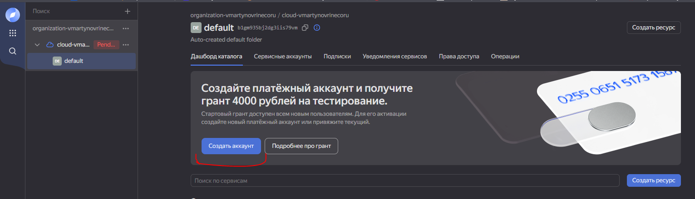
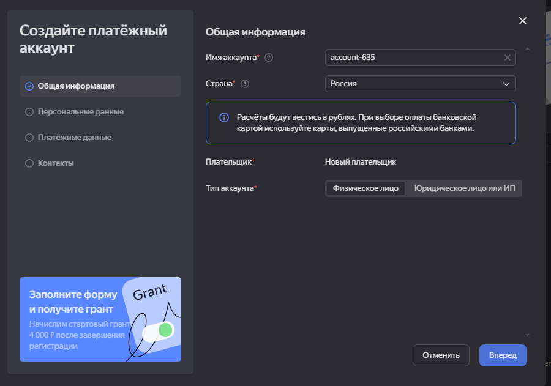
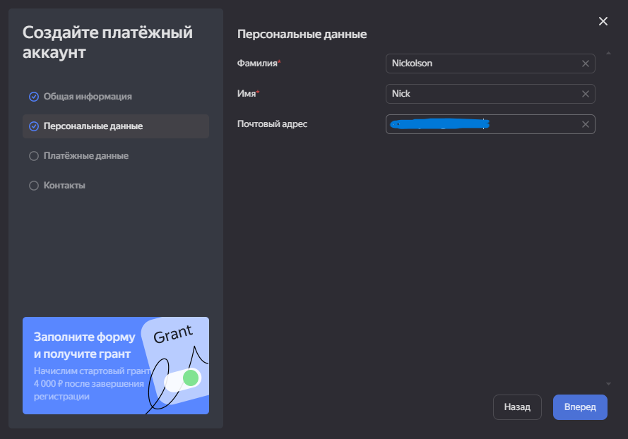
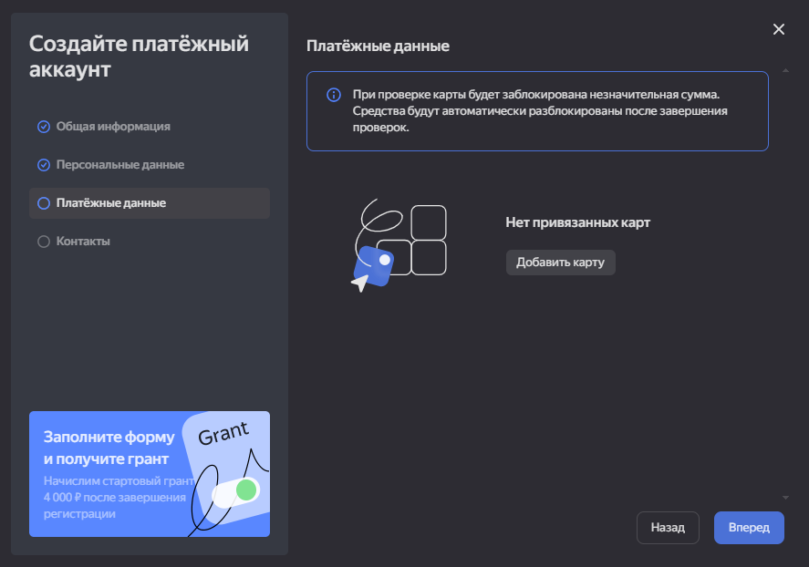
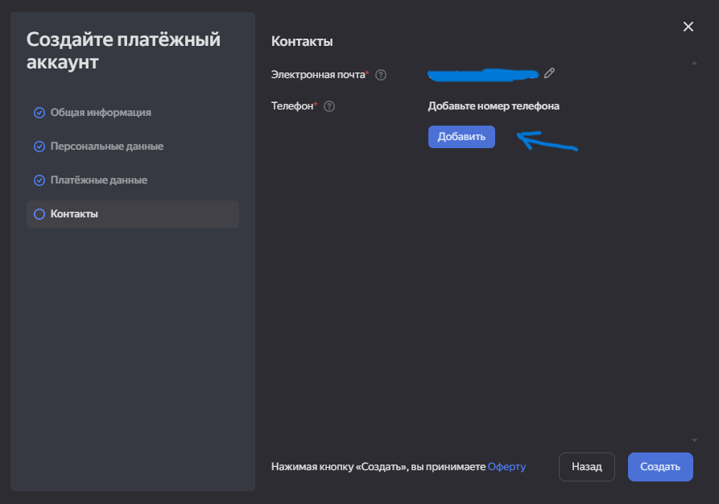
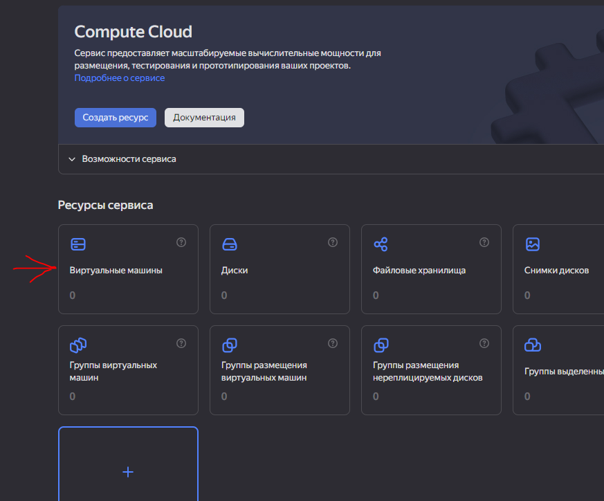
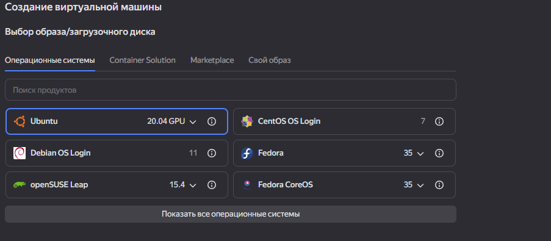
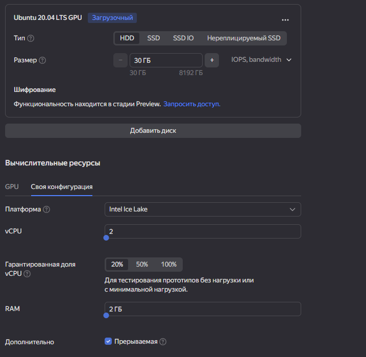
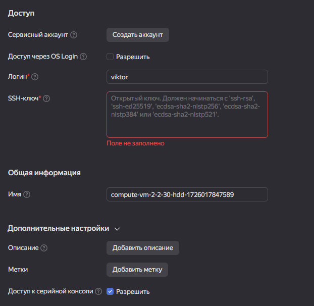
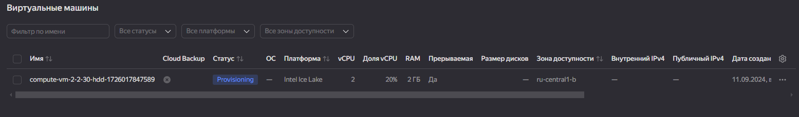

# Деплой проекта <u>Flask</u> на примере **Yandex Cloud**

[Назад](../README.md) к файлу README.md

### Содержание

* [Создание ключа](#генерация-ssh-ключа "Создание ssh-ключа")
* [Подключение](#подключение "Подключение")
* [Создание виртуальной машины](#создание-вм "Создание-ВМ") на хостинге
* [Создание пользователя](#создание-пользователя) с правами **админ**
* [Удаление пользователя](#удаление-пользователя)
* [Вход пользователя](#вход-пользователя-по-паролю-ключа) по паролю ключа
* [Развертывание проекта](#деплой-проекта)
<hr>

## Генерация ssh-ключа

Перейти и (или) создать директорию для хранения ssh-ключа, <br>
в терминале или консоли набрать команду:

```ruby
ssh-keygen -t rsa -b 2048 -C "description for key"-f name_key
```

где:
 - -t (указатель на тип ключа [dsa | ecdsa | ecdsa-sk | ed25519 | ed25519-sk | rsa]);
 - -b (ддлина (размер) ключа в байтах);
 - -C (комментарий для ключа);
 - -f (название файла ключа);

После этого сгенирируется два ключа:
 - <name_key>
 - <name_key>.pub

***дополнительно по аргументам ssh-keygen***
```ruby
ssh-keygen help
```
[К содержанию ↑](#содержание)
<hr>

## Подключение

<< В качествве примера создадим виртуальную машину на <u>[Yandex Cloud](https://console.yandex.cloud "Yandex Cloud")</u> >>

Перейдите на сайт сервиса
- Если не авторизованы, авторизируйтесь или зарегистрирутесь
- На главной странице (после авторизации) кликните кнопку "Подключить", далее создастся облако.
- Что бы продолжить, создайте платежный аккаунт, кликнув "Создать аккаунт"<br>

    

- Следующий шаг, можно все сотавить и нажимаем "Вперед"

    

- Привязать почтовый адрес
 
    

- Добавить карту

    

- Добавлям номер телефона и нажимаем на кнопку "Создать"

    
[К содержанию ↑](#содержание)
<hr>

## Создание ВМ

После того как платежный аккаунт создан.
- В меню "Все сервисы" выбираем "Compute Cloud"

    

- Далее выбираем Виртуальные машины

    

- Создаем виртуальную машину:

    * Ubuntu 20.04GPU (выбираем **OS**)

        

    * HDD минимальный размер (**30Гб**)
    * Вычислительные ресурсы для тестирования все на минимум:
        1. vCpu 2 ядра
        2. Доля процессоров **20%**
        3. RAM 2Гб
        4. Доплнительно "Прерываемая" - установить галочку
        
        
    
    * Настраиваем "Доступ"
        1. Логин <name>
        2. SSH-ключ (вставляем сгенерированный публичный ключ, <name_key.pub>)
        3. Доступ к серийной консоли, **установить галочку**

        

- Кликаем **"Создать ВМ"**

Создана виртуальная машина и хостинг


[К содержанию ↑](#содержание)
<hr>

## Создание пользователя

После того как виртуальная машина создана и **OS** запущена (**Runing**)

- Подключаемся через терминал
```ruby
ssh -i <name_key> <user_name>@84.201.137.109 #в нашем случае IP такой
```

- При подключении будет запрошен пароль от ключа. Вводим пароль
```ruby
Enter passphrase for key '<name_key>':
```

- После подключения должно выглядеть так
```ruby
Welcome to Ubuntu 20.04.6 LTS (GNU/Linux 5.13.0-40-generic x86_64)

 * Documentation:  https://help.ubuntu.com
 * Management:     https://landscape.canonical.com
 * Support:        https://ubuntu.com/pro
New release '22.04.3 LTS' available.
Run 'do-release-upgrade' to upgrade to it.

Last login: Wed Sep 11 02:52:50 2024 from 91.192.175.210
<user_name>@compute-vm-2-2-30-hdd-1726017847589:~$ 
```

- Передаем права **root**
```ruby
sudo su -

# в ответе будет строка с правами root
root@compute-vm-2-2-30-hdd-1726017847589:~$ 
```

- Создаем пользователя с правами администратора
```ruby
adduser user1   # Создаем пользователя
usermod -aG sudo user1   # Добавляем пользователя user1 в группу (sudo) администраторов

# и переключаемся на созданного пользователя
sudo su - user1

# в ответе увидим строку
user1@compute-vm-2-2-30-hdd-1726017847589:~$
```

[К содержанию ↑](#содержание)
<hr>

## Удаление пользователя

### Для удаление пользователя воспользуйтесь командой **deluser**

- Передайте права **root**
    
    * Если вы под созданным пользователем: то нажмите **Ctrl + D** или 
        ```ruby
        user1@compute-vm-2-2-30-hdd-1726017847589:~$ exit
        ```
    * Если вы только подключились к машине, введите команду:
        ```ruby
        <user_name>@compute-vm-2-2-30-hdd-1726017847589:~$ sudo su -
        
        # в ответе будет строка с правами root
        root@compute-vm-2-2-30-hdd-1726017847589:~$ 
        ```
- Удаляем пользователя
```ruby
root@compute-vm-2-2-30-hdd-1726017847589:~$ deluser user1
```

[К содержанию ↑](#содержание)
<hr>

## Вход пользователя по паролю ключа

* Под созданным пользователем "user1", создаем папку .ssh
    ```ruby
    user1@compute-vm-2-2-30-hdd-1726017847589:~$ mkdir -p ~/.ssh
    ```
* Наделяем ее уровнем доступа
    ```ruby
    user1@compute-vm-2-2-30-hdd-1726017847589:~$ chmod 700 ~/.shh
    ```
* Создаем файл для хранения ключа
    ```ruby
    user1@compute-vm-2-2-30-hdd-1726017847589:~$ echo "<name_key>.pub" >> ~/.ssh/authorized_keys
    ```
 Закрываем все соединения с сервером и вновь подключаемся от имени созданного пользователя

```ruby
<user_name>:~/<work_dir>$ ssh -i <name_key> user1@84.201.137.109
Enter passphrase for key 'timeweb':        # вводим пароль от ключа
Welcome to Ubuntu 20.04.6 LTS (GNU/Linux 5.15.0-119-generic x86_64)

 * Documentation:  https://help.ubuntu.com
 * Management:     https://landscape.canonical.com
 * Support:        https://ubuntu.com/pro
Last login: Wed Sep 11 16:39:23 2024 from 5.129.1.123
user1@compute-vm-2-2-30-hdd-1726069315868:~$
```
[К содержанию ↑](#содержание)
<hr>

## Деплой проекта

* Для запуска сервера с проектом, понадобиться скопировать файлы,
    с локального компьютера на удаленный.
* Воспользуемся быстрым и чрезвычайно универсальным инструментом 
    для копирования файлов <u>[Rsync](#span-stylecolorblueшпаргалка-по-rsyncspan)</u>

    ```ruby
    # Синтаксис
    rsync -Praz <locar_dir> <user_name>@<host>:<remote_dir>
    ```

* В нашем примере копируем [без указания ssh-ключа](#конфигурация-ssh)
    ```ruby
    <user_name>:~/GIT/python_advanced/module_08_deploy$ rsync -Praz materials/new_year_application user@84.201.144.90:workspace/
    ```

* В следующем примере копируем папку с файлами с помощью ssh-ключа
    ```ruby
    <user_name>:~/GIT/python_advanced/module_08_deploy$ rsync -e "ssh -i <name_key>" -Praz materials/new_year_application user@84.201.144.90:workspace/
    ```

* Ответом будет (для примера покажу начало копирование)
    ```ruby
    sending incremental file list
    new_year_application/
    new_year_application/app.py
                838 100%    0,00kB/s    0:00:00 (xfr#1, to-chk=49/51)
    new_year_application/__pycache__/
    new_year_application/__pycache__/app.cpython-312.pyc
              1.943 100%    1,85MB/s    0:00:00 (xfr#2, to-chk=46/51)
    ```

* Подключаемся к удаленному серверу
    ```ruby
    ssh -i <name_key> user1@84.201.137.109
    ```

* Переходим в директорию <u>workspace</u>
    ```ruby
    user1@compute-vm-2-2-30-hdd-1726069315868:~$ cd workspace/
    ```

* Активируем виртуальное окружение (предварительно установив <span style="color:yellow">python3-virtualenv</span>)
    ```ruby
    user1@compute-vm-2-2-30-hdd-1726069315868:~/workspace$ source <venv_name>/bin/activate
    
    # Ответ
    (venv) user1@compute-vm-2-2-30-hdd-1726069315868:~/workspace$
    
    # Устанавливаем Flask
    (venv) user1@compute-vm-2-2-30-hdd-1726069315868:~/workspace$ pip install flask
    ```

* Переходим в директорию <u>new_year_application</u>
    ```ruby
    (venv) user1@compute-vm-2-2-30-hdd-1726069315868:~/workspace$ cd new_year_application
    
    # Ответ
    (venv) user1@compute-vm-2-2-30-hdd-1726069315868:~/workspace/new_year_application$ 
    ```

* Запускаем наше flask приложение
    ```ruby
    (venv) user1@compute-vm-2-2-30-hdd-1726069315868:~/workspace/new_year_application$ flask run -h 0.0.0.0
    
    # Ответ
     * Debug mode: off
    WARNING: This is a development server. Do not use it in a production deployment. Use a production WSGI server instead.
     * Running on all addresses (0.0.0.0)
     * Running on http://127.0.0.1:5000
     * Running on http://10.130.0.26:5000
    Press CTRL+C to quit
   ```
* Переходим в браузер и вводим "публичный ip" и должно быть так же

    

[К содержанию ↑](#содержание)
<hr>

### <span style="color:blue">Шпаргалка по **rsync**</span>

* Синхронизация каталогов dir1 и dir2 на одной машине:
```ruby
rsync -a <dir1> <dir2>
```

* Синхронизация удалённой системы:
```ruby
rsync -a <local_dir> <username>@<remote_host>:<remote_dir>
```

* В обратную сторону:
```ruby
rsync -a <username>@<remote_host>:<remote_dir> <local_dir>
```

* Использование с ключом:
```ruby
rsync -e 'ssh -i timeweb' -Praz <local_dir> <username>@<remote_host>:<remote_dir>
```
* ОПЦИИ:
    - −r — рекурсивная синхронизация.
    - −a — режим архива, эквивалент -rlptgoD.
    - −z — сжатие данных.
    - −P — показать прогресс синхронизации.
    - −e — используется для задания параметров при подключении через SSH.

Полный список опций можно найти в [документации](https://linux.die.net/man/1/rsync)

[К содержанию ↑](#содержание)
<hr>

### <span style="color:yellow">Конфигурация SSH</span>

* Довольно неудобно каждый раз добавлять путь к ключу при подключении к серверу.
* И указывать его в <span style="color:yellow">rsync</span> тоже немного неприятно.
* По этому несколько шагов:

    1. На локальной машине создайте папку ~/.ssh и задайте на неё права:
       *  $ mkdir -p ~/.ssh
       *  $ chmod 700 ~/.ssh
    
    2. Создайте в папке ~/.ssh файл с именем config:
       * $ touch ~/.ssh/config && chmod 600 ~/.ssh/config
    
    3. Скопируйте приватный и публичный ключи в папку ~/.ssh/:
       * $ cp -fv timeweb timeweb.pub ~/.ssh/
       * $ chmod 600 ~/.ssh/timeweb*
    
    4. Отредактируйте файл ~/.ssh/config, написав следующие строки:
        * Host <ip_address_of_your_machine>
        * User <your_remote_system_user_name>
        * IdentityFile ~/.ssh/timeweb

* Теперь можно подключаться к удаленному серверу без объявления ключа

```ruby
ssh user1@84.201.137.109
```

[К содержанию ↑](#содержание)
<hr>