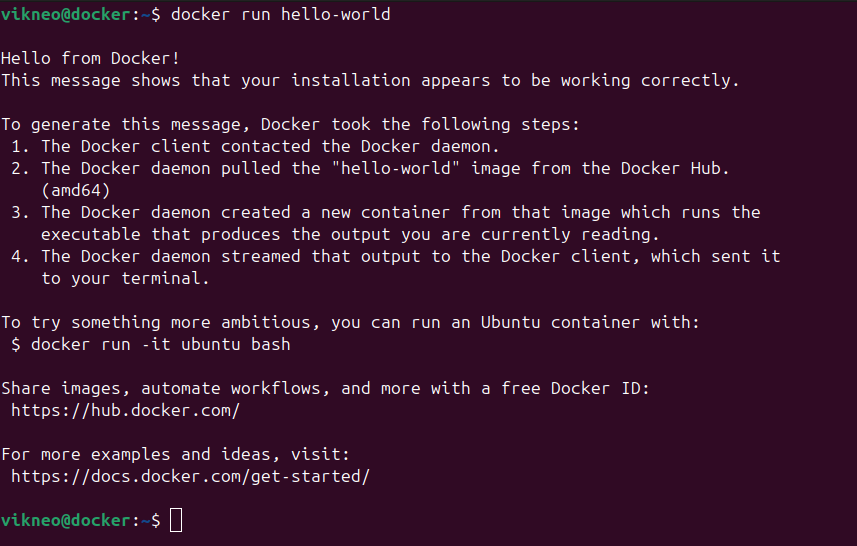

# Запуск контейнеров в Docker

[<< Назад](../Docker.md)

Синтаксис:
```html
docker [OPTIONS] COMMAND [args...]
```
### Полный список опций и команд [здесь](commands.md)

* [Управление контейнерами](#управление)
* [Docker exec]()
* **[htop]()** - мониторинг контейнера


* Первый пробный запуск:
  ```html
  docker run hello-world
  ```
   

* Загрузка образа на локальную машину:
```html
docker pull ubuntu
```

* Или конкретную версию:
```html
docker pull ubuntu:20.04
```

* Запустить командную оболочку контейнера:
```html
docker run -it ubuntu
```

<hr>

## Управление

* **Собрать контейнер в текущей директории**
```html
docker build . -t <name_tag>
```

* **Запустить контейнер с пробросом порта**
```html
docker run -p5050:5000 -it <name_tag> bash
```

* **Запустить контейнер с пробросом порта и перезапуском**
```html
docker run --restart=always -p5050:5000 -it <name_tag> bash
```

* **Для просмотра установленных образов**:
```html
docker images
```

* **Для просмотра запущенных контейнеров**:
```html
docker ps
```

* **Весь список контейнеров**:
```html
docker ps -a
```

* **Последний созданный контейнер**:
```html
docker ps -l
```

* **Удаление**:
  - Перед удалением образа требуется удалить сам контейнер
    ```html
    docker rm <container_id> 
    ```
  - Далее следует команда для удаления образа
    ```html
      docker rmi <image_id>
    ```

* **Запустить контейнер**:
```html
docker start <container_id>
```

* **Остановить контейнер**:
```html
docker stop <container_id>
```
