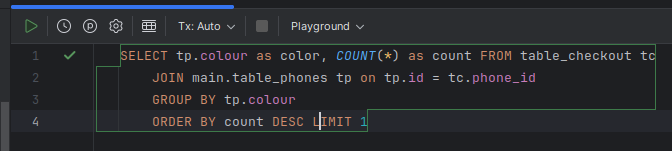
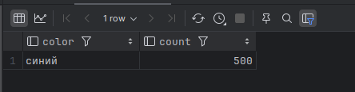
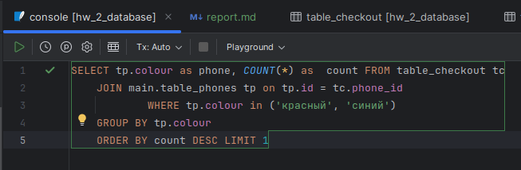
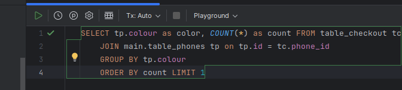
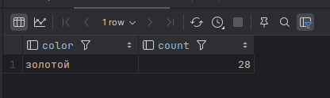

# Ответы на вопросы к задаче 2

## Условие задачи

* Представьте, что вы работаете программистом в крупной сети розничных продаж телефонов. 
К вам пришли из отдела маркетинга и поставили задачу выяснить соотношение продаж телефонов 
в зависимости от их цвета.

* Откройте в IDE БД hw_2_database.db. Используя таблицы table_checkout и table_phones, 
найдите ответы на следующие вопросы:
1. Телефоны какого цвета чаще всего покупают?
2. Какие телефоны чаще покупают: красные или синие?
3. Какой самый непопулярный цвет телефона?

<hr>

## Ответы

### 1. Телефоны какого цвета чаще всего покупают?

   * Выборка из БД

   
      
   * Ответ
   
   

   ```html
   SELECT tp.colour as color, COUNT(*) as count FROM table_checkout tc
       JOIN main.table_phones tp on tp.id = tc.phone_id
       GROUP BY tp.colour
       ORDER BY count DESC LIMIT 1
   ```
       
   Здесь:<br> 
   группируется поле **"colour"** в таблице **"table_phone""**, <br>
   находятся общее кол-во проданных телефонов по цветам, сортируются по убыванию <br>
   и выводится **первый** из списка цвет (**color**) и его общее кол-во (**count**) проданных телефонов<br>

<hr>

### 2. Какие телефоны чаще покупают: красные или синие?

   * Запрос к БД
   
   
   
   * Ответ
   
   
   
   ```html
   SELECT tp.colour as phone, COUNT(*) as  count FROM table_checkout tc
       JOIN main.table_phones tp on tp.id = tc.phone_id
               WHERE tp.colour in ('красный', 'синий')
       GROUP BY tp.colour
       ORDER BY count DESC LIMIT 1
   ```
   
   Здесь:<br>
   группируется поле **"colour"** в таблице **"table_phone""** при условии, <br>
   что цвета (красный и синий) присутствуют в поиске и находится общее кол-во <br> 
   проданных телефонов данных цветов, сортируются по убыванию и выводится **первый** <br>
   из списка цвет (**colour**) и его кол-во (**count**) проданных телефонов
   
<hr>

### 3. Какой самый непопулярный цвет телефона?

   * Запрос в БД
   
   
   
   * Ответ
   
   

   ```html
   SELECT tp.colour as color, COUNT(*) as count FROM table_checkout tc
       JOIN main.table_phones tp on tp.id = tc.phone_id
       GROUP BY tp.colour
       ORDER BY count LIMIT 1
   ```

   Здесь: <br>
   группируется поле **"colour"** в таблице **"table_phone""**, <br>
   находятся общее кол-во проданных телефонов по цветам, сортируются по возрастанию <br>
   (по умолчанию "по возрастанию ASC") и выводится **первый** из списка цвет (**color**) и <br>
   его общее кол-во (**count**) проданных телефонов<br>
   
