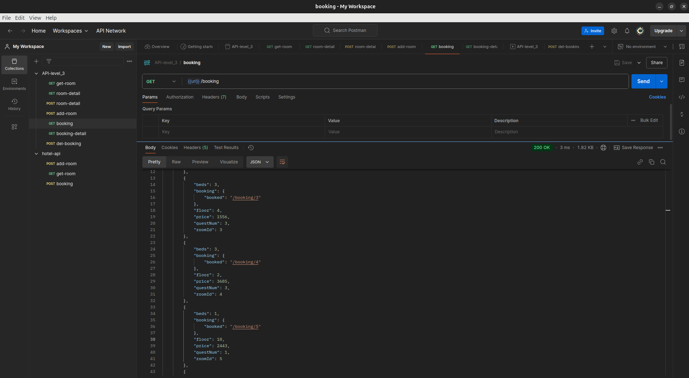

# Задача 2. Повышаем уровень зрелости
Уровень зрелости текущей postman-collection -`2` <br>
Данную коллекцию можно улучшить до уровня - `3`

* Операции с детальной информацией о комнате: <br>
    просмотр отдельной комнаты, <br>
    бронирование комнаты <br>
    methods(GET, POST)
   ```html
        localhost:5000/room_detail/room_id
    ```


* Операции с бронированием комнат: <br>
    ```
        localhost:5000/booking 
    ```
    получить весь список доступных комнат, <br>
    доступна ссылка на конкретную комнату <br>
    methods(GET)
    ```
        localhost:5000/booking-detail/room_id
    ```
    получить информацию о комнате <br>
    забронировать номер <br>
    methods(GET, POST)
    ```
        localhost:5000/del-booking/room_id
    ```
    отменить бронирование комнаты <br>
    methods(POST)

## Report screen

