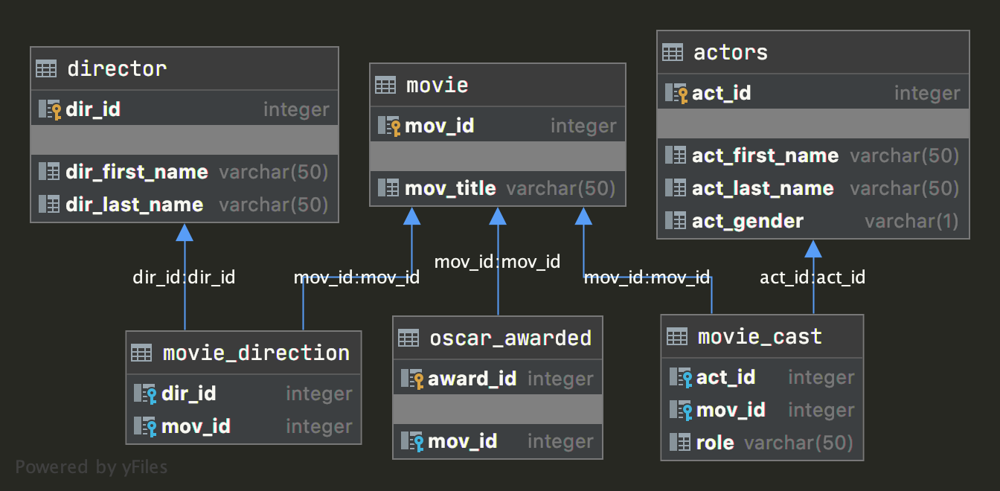
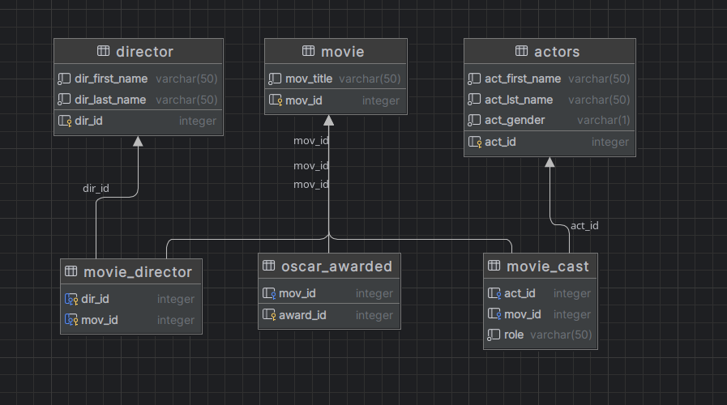

## Типы связей между таблицами в схеме



```html
+---------------+---------------+----------------+
|   Тип связи   |   Таблица 1   |    Таблица 2   |
|---------------|---------------|----------------|
|  one-to_many  |   director    | movie_director |
|---------------|---------------|----------------|
|  one-to_many  |    movie      | movie_director |
|---------------|---------------|----------------|
|  one-to_one   |    movie      | oscar_awarded  |
|---------------|---------------|----------------|
|  one-to_many  |    movie      |  movie_cast    |
|---------------|---------------|----------------|
|  one-to_many  |    actors     |  movie_cast    |
+---------------+---------------+----------------+
```

## Report diagram tables



<hr>

P.S таблицы 'director' и 'movie' имеют связь как "Many-To-Many"
```html
+---------------+---------------+----------------+
|   Тип связи   |   Таблица 1   |    Таблица 2   |
|---------------|---------------|----------------|
| many-to_many  |   director    |     movie      |
+---------------+---------------+----------------+
```
