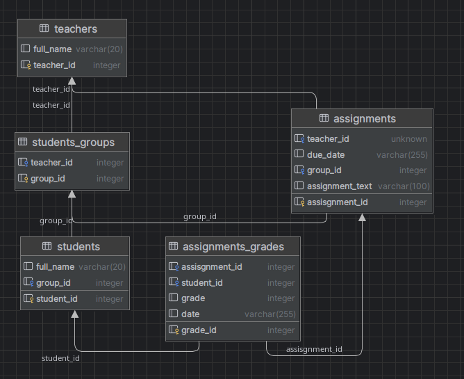

# Базы данных. Часть 4
## 19.4 Практическая работа

### Диаграмма базы данной




1. Узнайте, кто из преподавателей задаёт самые сложные задания. 
    Другими словами, задания какого преподавателя получают в среднем худшие оценки.

   ```html
    SELECT round(avg(grade.grade), 2) as avg_grade, t.full_name as teacher_name
    FROM assignments_grades grade
           JOIN assignments a ON a.assisgnment_id = grade.assisgnment_id
           JOIN teachers t ON t.teacher_id = a.teacher_id
    GROUP BY grade.assisgnment_id
    ORDER BY avg_grade
    LIMIT 1
   ```
2. Дирекция школы решила наградить лучших учеников грамотами, но вот беда, в принтере картриджа хватит 
   всего на 10 бланков. Выберите 10 лучших учеников с лучшими оценками в сроеднем. 
   Не забудьте отсортировать список в низходящем порядке

    ```html
    SELECT round(avg(grade.grade), 2) as avg_grade, t.full_name as teacher_name
    FROM assignments_grades grade
           JOIN assignments a ON a.assisgnment_id = grade.assisgnment_id
           JOIN teachers t ON t.teacher_id = a.teacher_id
    GROUP BY grade.assisgnment_id
    ORDER BY avg_grade DESC
    LIMIT 10
    ```
   