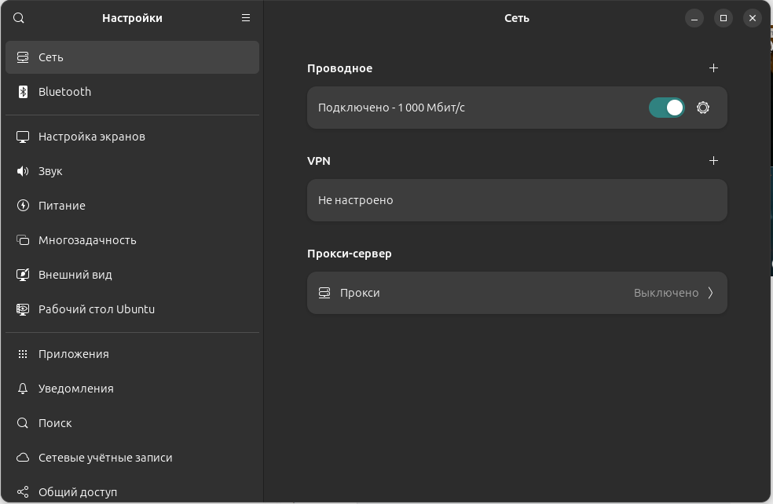
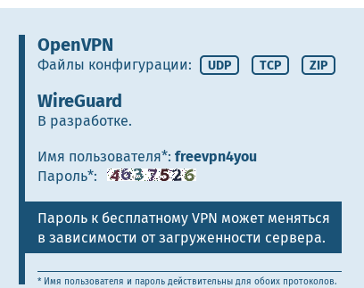
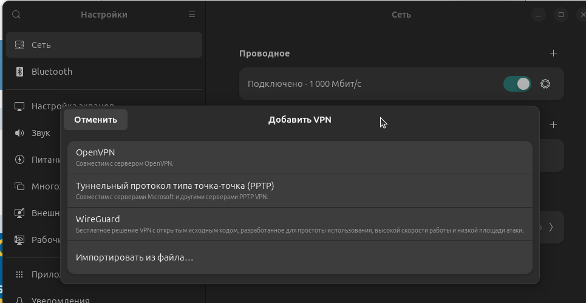
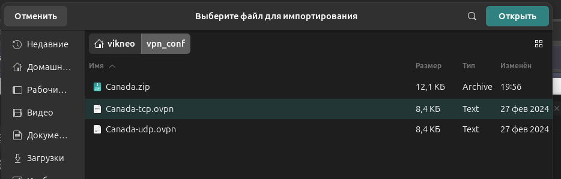
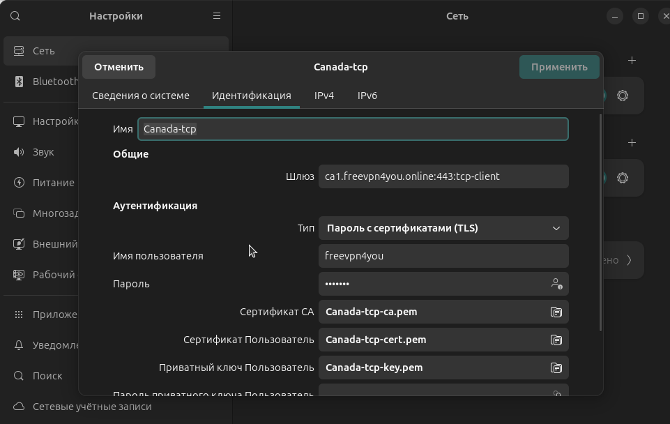
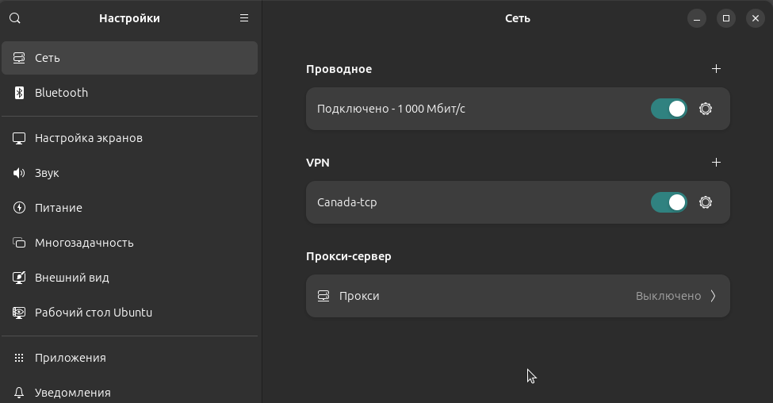
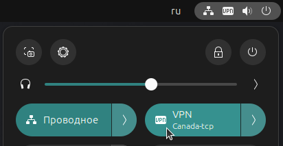

# Настройка VPN для Linux (Ubuntu 22)

*актуально на 19.02.2025* [Виктор](https://github.com/vikneo)

## Настраиваем через OpenVPN

<p style="font-size: 16px">
Захожим в настройки и ищем сеть, там же будет и VPN,
что бы создать VPN соединение нажимаем на <b>+</b>.
</p>



<p style="font-size: 16px">
Будем использовать VPN сервер на сайте 
<a href="https://freevpn4you.net/ru/locations/canada.php#google_vignette">FreeVPN4you</a>
</p>

***Если не удается зайти на сайт, можно воспользоваться браузером TOR***

*  Я выбрал Бесплатный VPN-сервер в Канаде
* Качаем архив в zip файле



* создаем папку например **vpn_conf** (команда в терминале) и переходим в нее

```html
-$ mkdir vpn_conf

-$ cd ~/vpn_conf/
```
* Из папки загрузок в Tor-браузере копируем архив в нашу **vpn_conf** папку
```html
-$ cp tor-browser-linux-x86_64-13.5.1/tor-browser/Browser/Загрузки/Canada.zip vpn_conf/
```
* Распаковываем архив

```html
-$ unzip ./Canada.zip 
```
## Добавляем VPN



* Нажимаем **Импортировать из файла** и выбираем файл **Canada-tcp.ovpn**



* В поле **Идентификация**
  - вводим логин ***freevpn4you*** предоставленный сайтом FreeVPN4you
  - вводим пароль (пароль сверяйте на сайте, он может меняться)



* И нажимаем **Добавить**

<p style="font-size: 20px">
Создастся VPN и нажмите подключиться
</p>



<p style="font-size: 20px">
Когда VPN подключится, вы увидите иконку **VPN**
</p>



### С этого момента можно установить плагины на PyCharm которые не доступны
### Или побродить по сайтам (закрытым для нашей аудитории) :)
## Good luck, Amigo!

<hr>
