## Подключение Grafana

### Пример по настройке [dashboard](https://github.com/rycus86/prometheus_flask_exporter/tree/master/examples/sample-signals) в grafana

* СОДЕРЖАНИЕ
  * Создать [Data Source](#создаем-источник-данных)
  * Добавить [Panel](#здесь-будем-фильтровать-по-status_code-200)
  * Работаем с [JSON](#сохраняем-json)

<hr>

* В файле *docker-compose* мы создали контейнер с подключением **grafana**
```html
    # Подключение визуализации мониторинга "Grafana"
  grafana:
    image: grafana/grafana:5.1.0
    ports:
      - "3000:3000"
```

* После запуска сервера, к **Grafana** будет доступ по пути
```html
http://localhost:3000
```
* Появится окно с вводом логина и пароля (по умолчанию **admin** / **admin**)

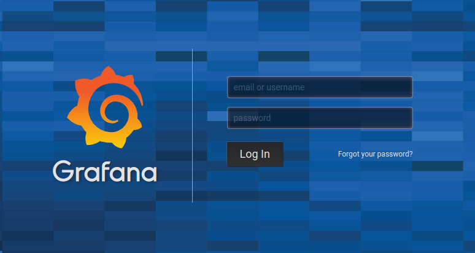

### Создаем источник данных

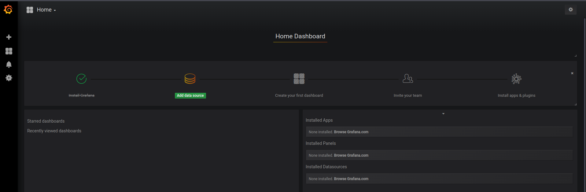

* Настраиваем источник данных (выбираем **Prometheus**, задаем имя, определяем адрес и порт источника)

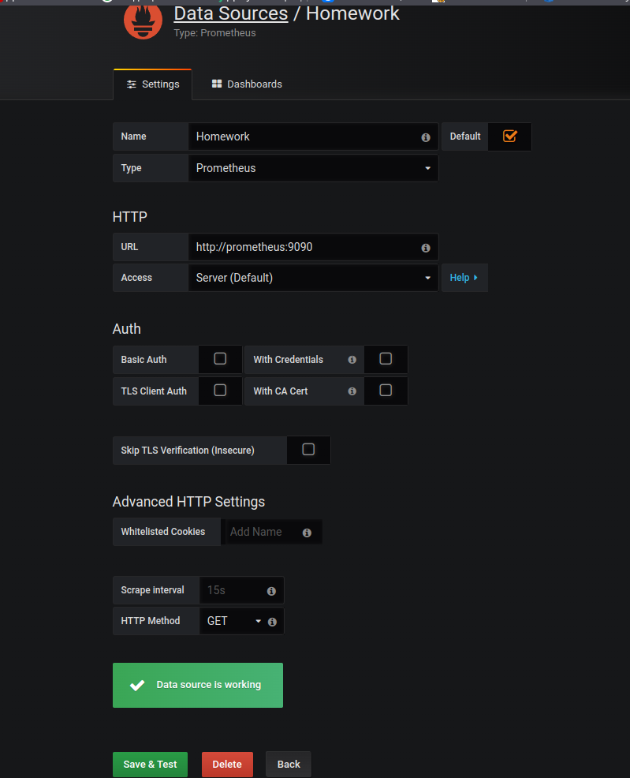

* Нажимаем **Save and test**, если все верно появиться надпись **Data source is working**. Далее нажимаем **Back** 

### Настраиваем Dashboard

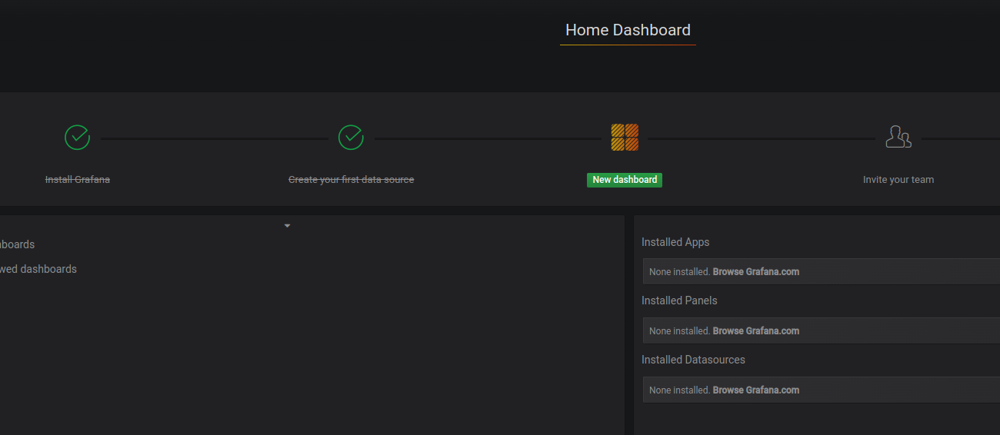

* Создаем панель **Graph**

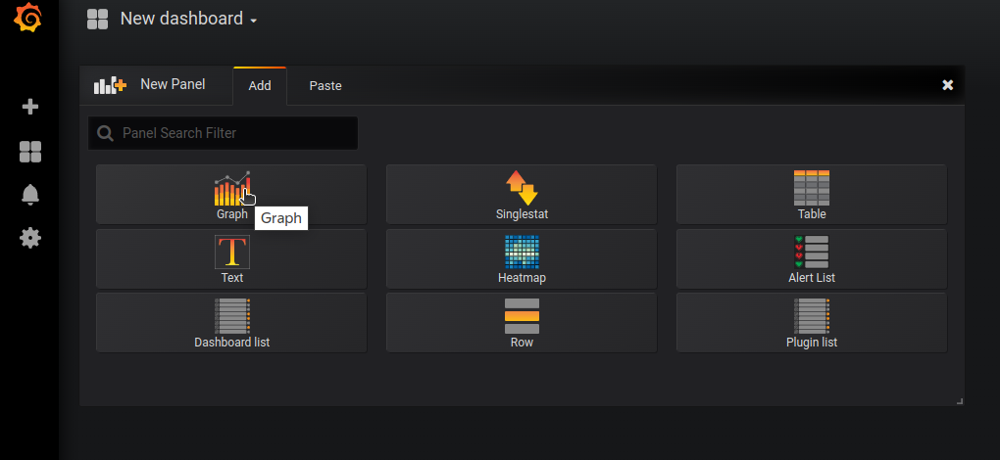

* В следующем окне выбираем **Edit**

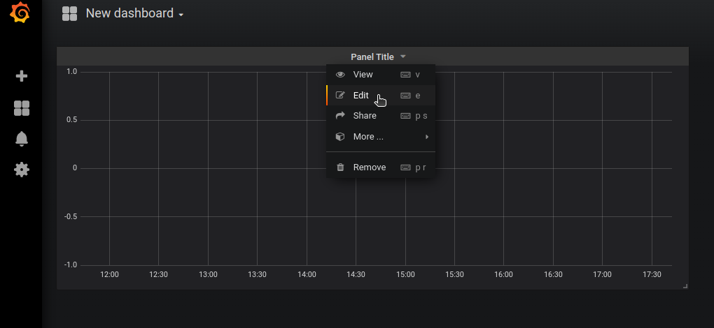

### Здесь будем фильтровать по status_code 200

* В поле **Data Source** выбираем наш источник данных

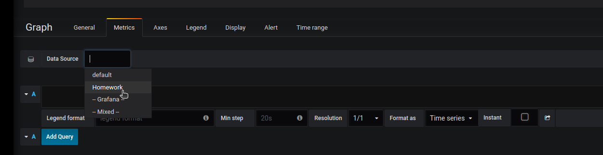

* Переходим по адресу **http://localhost:5000/metrics** прежде посетив наши *endpoints*
Перед нами появится страница с метриками, Вот часть из всей информации

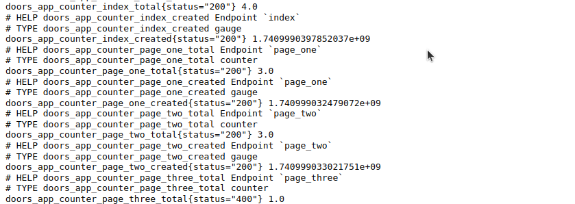

* Для нашей задачи интересуют переменные которые мы определили для наших **endpoints**
с суффиксом `**_total**`
```html
# т.е. для endpoint `index`
doors_app_counter_index_total{status="200"} 5.0

# где 5.0 - это наш счетчик посещений страницы
```

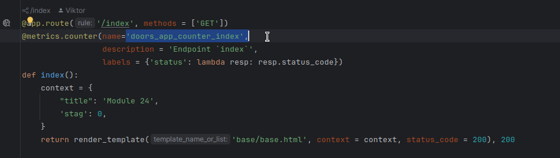

* Вводим эту переменную, задаем ей имя для отображения на панели
* Если требуется добавить еще точек нажмите кнопку **Add Query** 

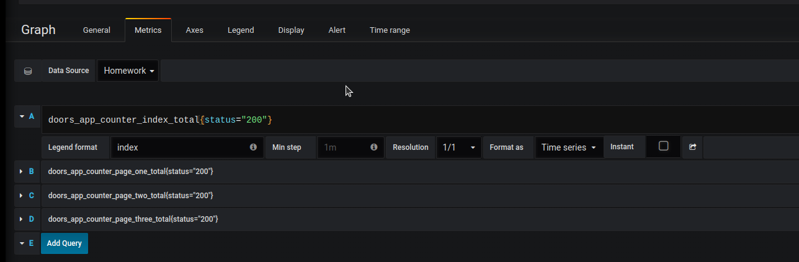

* Для более хорошей визуализации можно настроить поле **Legend**

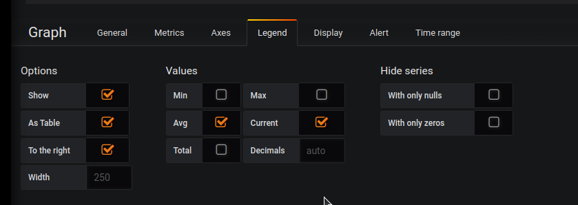

* И в правом верхнем углу отобразятся наши точки

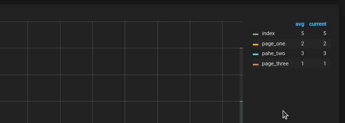

* Сохраняем наши настройки

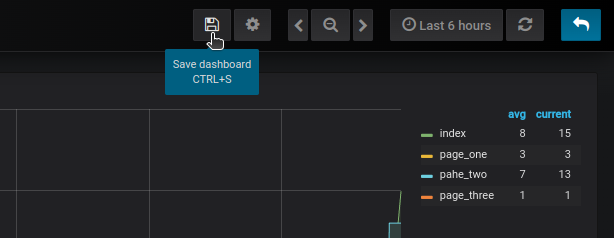

* Задаем имя нашей сборки

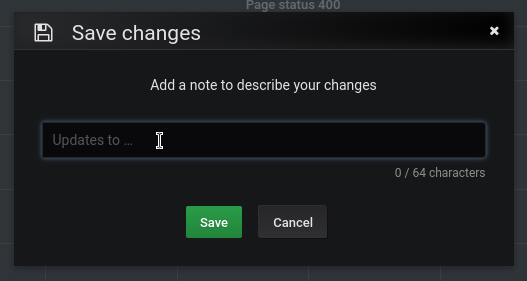

### Добавить график и отфильтровать по status_code 500 - аналогично предыдущему фильтру

## Итого

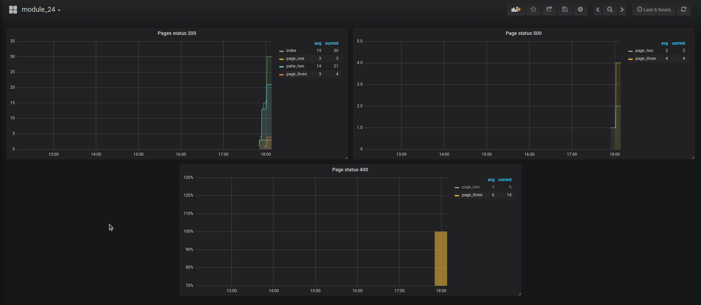

<hr>

### Сохраняем json

* После сохранения настроек **Dashboard** можем сохранить все данные в файл **json**
* Для этого зайдем в настройки

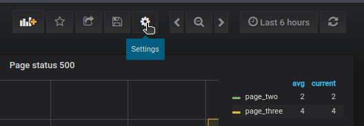

* И выбираем меню **View JSON**

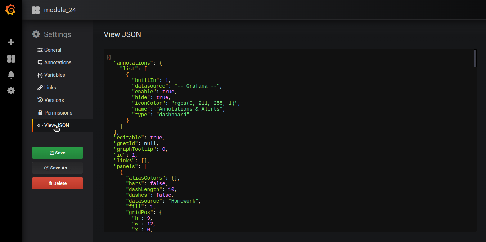

* Копируете все содержимое файла и сохраняете у себя (можно в проекте)
* Например:

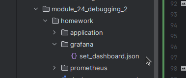

<hr>

### Итого

* При последующем подключении: 
* Вам потребуется снова создать источник данных;
* И импортировать **json** с настройками

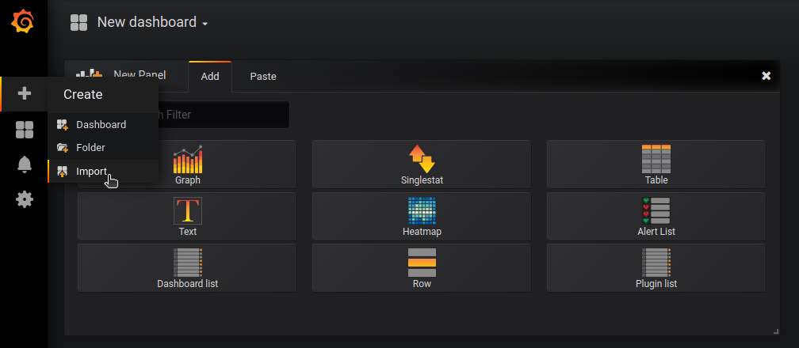
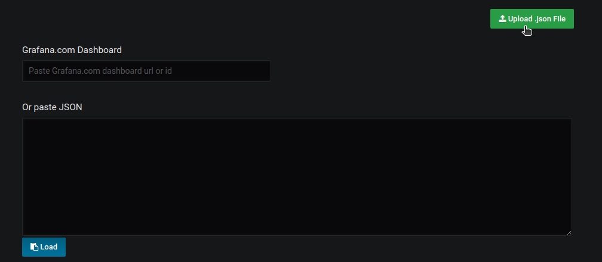
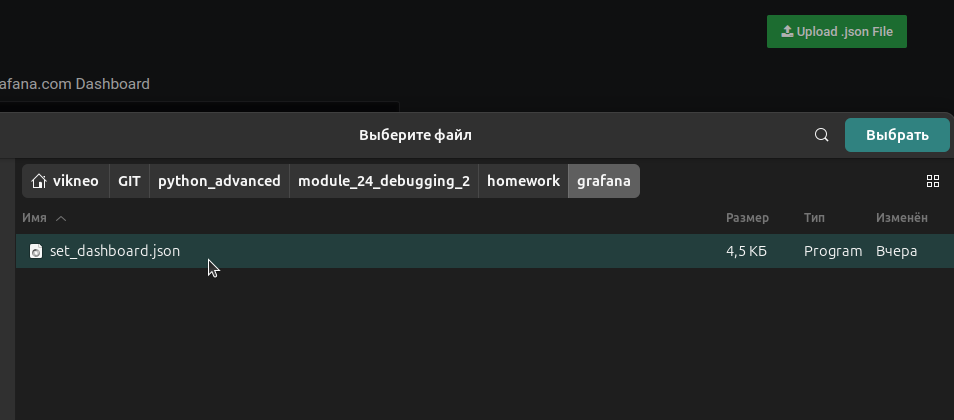
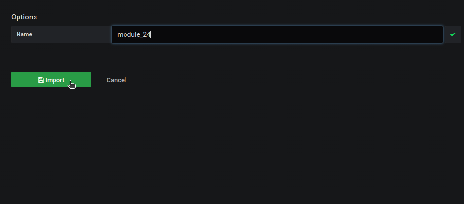
