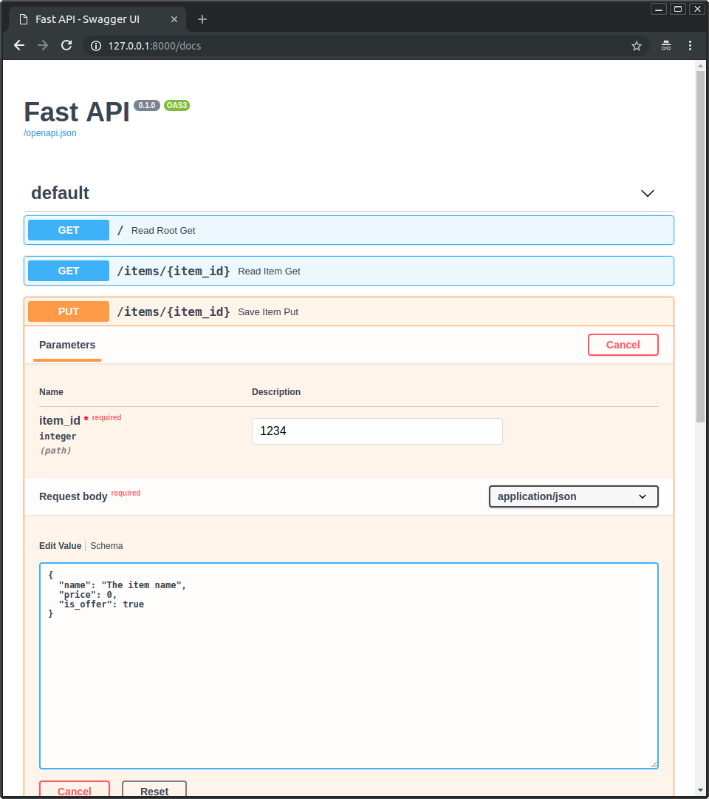
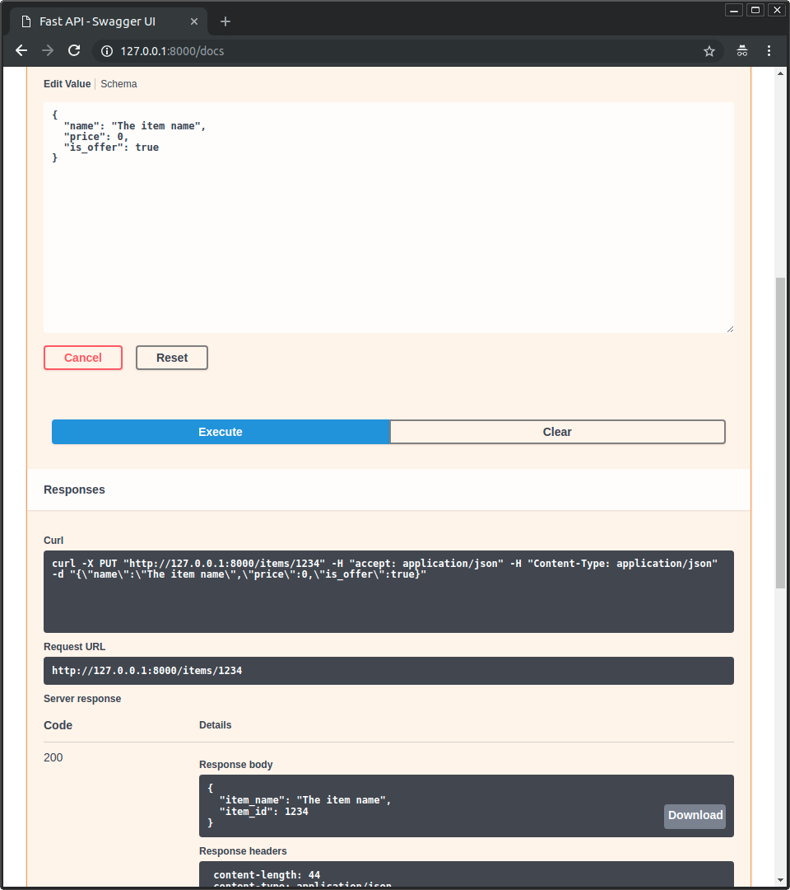
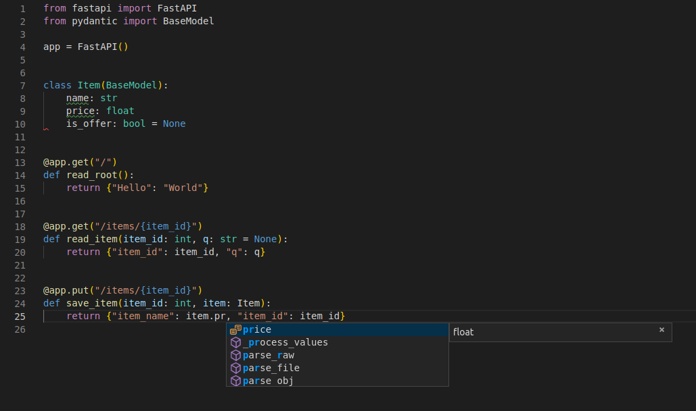

<p align="center">
  <a href="https://fastapi.tiangolo.com/"></a>
</p>
<p align="center">
    <em>FastAPI framework, high performance, easy to learn, fast to code, ready for production</em>
</p>
<p align="center">
<a href="https://github.com/fastapi/fastapi/actions?query=workflow%3ATest+event%3Apush+branch%3Amaster" target="_blank">
    
</a>
<a href="https://coverage-badge.samuelcolvin.workers.dev/redirect/fastapi/fastapi" target="_blank">
    
</a>
<a href="https://pypi.org/project/fastapi" target="_blank">
    
</a>
<a href="https://pypi.org/project/fastapi" target="_blank">
    
</a>
</p>

---
*Переведено 13.03.2025.*

**Документация**: <a href="https://fastapi.tiangolo.com" target="_blank">https://fastapi.tiangolo.com</a>

**Проект FstAPI**: <a href="https://pypi.org/project/fastapi/">https://pypi.org/project/fastapi/</a>

**Исходник на GitHub**: <a href="https://github.com/fastapi/fastapi" target="_blank">https://github.com/fastapi/fastapi</a>

---

FastAPI это современный, быстрый (высокопроизводительный), веб-фреймворк для создания API с помощью стандартного Python.

Ключевые особенности:

* **Fast**: Очень высокая производительность, на уровне с **NodeJS** и **Go** (спасибо Starlette и Pydantic). [Один из самых быстрых фреймворков доступных для Python](#производительность).
* **Fast to code**: Увеличенная скорость разработки, примерно на 200%-300%. *
* **Fewer bugs**: Сокращение количества ошибок, до 40% вызванных самим разработчиком. *
* **Intuitive**: Интуитивная поддержка. Автозаполнение в редакторе кода, что экономит время отладки.
* **Easy**: Лёгкость использования. Минимум времени для изучения документации.
* **Short**: Минимизация дублирования кода. Несколько функций от каждого объявления параметра.
* **Robust**: Получить готовый к работе код. С автоматической интерактивной документацией.
* **Standards-based**: Основан на открытых стандартах создания API и полностью совместим с ними: <a href="https://github.com/OAI/OpenAPI-Specification" class="external-link" target="_blank">OpenAPI</a> (ранее именовался как Swagger) и <a href="https://json-schema.org/" class="external-link" target="_blank">JSON Schema</a>.

<small>* Оценка, основанная на тестах команд разработчиков, создающих производственные приложения .</small>

---

## **Typer**, как FastAPI для CLIs

Если вы создаете приложение, которое будет использоваться в <abbr title="Command Line Interface">CLI</abbr> терминале вместо веб-API, ознакомьтесь с <a href="https://typer.tiangolo.com/" class="external-link" target="_blank">**Typer**</a>.

**Typer** это младший братец FastAPI. И он предназначен как **FastAPI для CLIs**. ⌨️ 🚀

## Требования

FastAPI стоит на плечах двух гигантов:

* <a href="https://www.starlette.io/" class="external-link" target="_blank">Starlette</a> для работы с частью веб интерфейса.
* <a href="https://docs.pydantic.dev/" class="external-link" target="_blank">Pydantic</a> для работы с частью данных.

## Установка

Создайте и активируйте <a href="https://fastapi.tiangolo.com/virtual-environments/" class="external-link" target="_blank">виртуальное окружение</a> и установите FastAPI:

<div class="termy">

```console
$ pip install "fastapi[standard]"

---> 100%
```

</div>

**Прим.**: Убедитесь, что модуль `"fastapi[standard]"` заключен в ковычки.

## Пример

### Создать приложение

* Создайте файл с названием `main.py`:

```Python
from typing import Union

from fastapi import FastAPI

app = FastAPI()


@app.get("/")
def read_root():
    return {"Hello": "World"}


@app.get("/items/{item_id}")
def read_item(item_id: int, q: Union[str, None] = None):
    return {"item_id": item_id, "q": q}
```

<details markdown="1">
<summary>Или с использованием <code>async def</code>...</summary>

Если в коде используете `async` / `await`, то воспользуйтесь `async def`:

```Python hl_lines="9  14"
from typing import Union

from fastapi import FastAPI

app = FastAPI()


@app.get("/")
async def read_root():
    return {"Hello": "World"}


@app.get("/items/{item_id}")
async def read_item(item_id: int, q: Union[str, None] = None):
    return {"item_id": item_id, "q": q}
```

**Прим.**:

Ознакомится с <a href="https://fastapi.tiangolo.com/async/#in-a-hurry" target="_blank">`async` и `await`можно в документации</a>.

</details>

### Запустить

Запуск сервера:

<div class="termy">

```console
$ fastapi dev main.py

 ╭────────── FastAPI CLI - Development mode ───────────╮
 │                                                     │
 │  Serving at: http://127.0.0.1:8000                  │
 │                                                     │
 │  API docs: http://127.0.0.1:8000/docs               │
 │                                                     │
 │  Running in development mode, for production use:   │
 │                                                     │
 │  fastapi run                                        │
 │                                                     │
 ╰─────────────────────────────────────────────────────╯

INFO:     Will watch for changes in these directories: ['/home/user/code/awesomeapp']
INFO:     Uvicorn running on http://127.0.0.1:8000 (Press CTRL+C to quit)
INFO:     Started reloader process [2248755] using WatchFiles
INFO:     Started server process [2248757]
INFO:     Waiting for application startup.
INFO:     Application startup complete.
```

</div>

<details markdown="1">
<summary>О команде <code>fastapi dev main.py</code>...</summary>

Команда `fastapi dev` считывает ваш `main.py` файл, ищет в нем **FastAPI** приложение именуемое как (app), и запускает серввер с поддержкой <a href="https://www.uvicorn.org" class="external-link" target="_blank">Uvicorn</a>.

По умолчанию, `fastapi dev` запускает сервер с "авто перезагрузкой" для локальной разработки (При изменении в коде - сервер перезапустится).

Вы можете прочитать больше о <a href="https://fastapi.tiangolo.com/fastapi-cli/" target="_blank">FastAPI CLI docs</a>.

</details>

### Проверка

Откройте ваш браузер и перейдите на страницу <a href="http://127.0.0.1:8000/items/5?q=somequery" class="external-link" target="_blank">http://127.0.0.1:8000/items/5?q=somequery</a>.

Вы увидите JSON ответ похожий на этот:

```JSON
{"item_id": 5, "q": "somequery"}
```

Вы уже создали API, который:

* Получает HTTP-запросы по путям (_paths_) `/` и `/items/{item_id}`.
* Оба пути (_paths_) имеют <em>операции</em> `GET` (известные в HTTP как методы (_methods_)).
* Путь `/items/{item_id}` имеет параметр (_path parameter_) `item_id` c типом `int`.
* A так же `/items/{item_id}` имеет не обязательный параметр (_query parameter_) `q` с типом `str`.

### Интерактивная API документация

Теперь можно перейти <a href="http://127.0.0.1:8000/docs" class="external-link" target="_blank">http://127.0.0.1:8000/docs</a>.

Здесь вы можете увидеть интерактивную документацию по созданому API (представленную <a href="https://github.com/swagger-api/swagger-ui" class="external-link" target="_blank">Swagger UI</a>):

<!--  -->


### Альтернативная API документация

Перейдя на <a href="http://127.0.0.1:8000/redoc" class="external-link" target="_blank">http://127.0.0.1:8000/redoc</a>.

Здесь вы увидите альтернативную документацию по API (представленную <a href="https://github.com/Rebilly/ReDoc" class="external-link" target="_blank">ReDoc</a>):

<!--  -->


## Пример перезапуска сервера

Теперь измените файл `main.py` что бы получить тело `PUT` запроса.

Объявите фнкцию, которая будет обрабатывать `PUT`запрос.

```Python hl_lines="4  9-12  25-27"
from typing import Union

from fastapi import FastAPI
from pydantic import BaseModel

app = FastAPI()


class Item(BaseModel):
    name: str
    price: float
    is_offer: Union[bool, None] = None


@app.get("/")
def read_root():
    return {"Hello": "World"}


@app.get("/items/{item_id}")
def read_item(item_id: int, q: Union[str, None] = None):
    return {"item_id": item_id, "q": q}


@app.put("/items/{item_id}")
def update_item(item_id: int, item: Item):
    return {"item_name": item.name, "item_id": item_id}
```

Команда `fastapi dev` после изменений перезапустит сервер автоматически.

### Перезапуск интерактивной API документации

Перейдем на <a href="http://127.0.0.1:8000/docs" class="external-link" target="_blank">http://127.0.0.1:8000/docs</a>.

* Вы увидите как API документация автоматически обновилась (добавился новый метод `PUT`):

<!--  -->


* Нажимите на "Try it out", что позволит вам заполнять параметры и напрямую взаимодействовать с API:

<!--  -->


* Затем нажмите "Execute", под капотом создастся запрос `curl` и передаст параметры методом `PUT` в функцию `update_item`, которая обработает запрос и вернет результат:



### Перезапуск альтернативной API документации

Перейдите на <a href="http://127.0.0.1:8000/redoc" class="external-link" target="_blank">http://127.0.0.1:8000/redoc</a>.

* В альтернативной версии видно, как отражен новый параметр с текстом запроса:


---

### Резюме

Таким образом, вы **один раз** объявляете типы параметров, тела и т.д. как параметры функции.

Разработка приложений с помощью современных технологий Python.

Не требует дополнительного обучения синтаксиса, методов или классов.

Обычный стандартный **Python**.

Например, для анотации `int`:

```Python
item_id: int
```

или для модели `Item`:

```Python
item: Item
```

...с помощью таких объявлений, вы получаете:

* Улучшенная поддержка IDE, включительно:
    * Успешное завершение функции.
    * Проверка типов данных.
* Валидация данных:
    * Понятные ошибки при вводе неверных данных.
    * Валидация даже для глубоко вложенных объектов JSON.
* <abbr title="also known as: serialization, parsing, marshalling">Преобразование</abbr> входных данных: в типы Python - полученных из сети или чтение из:
    * JSON.
    * Path parameters.
    * Query parameters.
    * Cookies.
    * Headers.
    * Forms.
    * Files.
* <abbr title="also known as: serialization, parsing, marshalling">Преобразование</abbr> выходных данных: из типов Python в данные формата JSON:
    * Преобразование типов Python(`str`, `int`, `float`, `bool`, `list`, т.д.).
    * `datetime` объекты.
    * `UUID` объекты.
    * Модели базы данных.
    * ...и многое другое.
* Интерактивная API документация, включает в себя два пользовательских интерфейса:
    * Swagger UI.
    * ReDoc.

---

Возвращаясь к предыдущему примеру, **FastAPI** будет:

* Проверять на присутсвие `item_id` в пути `GET` и `PUT` запроса.
* Проверять, что `item_id` имеет тип `int` для `GET` и `PUT` запроса.
    * Если это не так, пользователь увидит понятное сообщение об ошибке.
* Проверять присутствует ли не обязательный параметр `q` (как в `http://127.0.0.1:8000/items/foo?q=somequery`) для `GET` запроса.
    * Так как параметр `q` по умолчанию имеет значение `= None`, не необязателен.
    * Без `None` будет обязательным (так же и с методом `PUT`).
* Для `PUT` запроса по пути `/items/{item_id}`, считывать данные как JSON:
    * Проверять, что есть обязательный аттрибут `name` и соответствует типу `str`.
    * Проверять, что есть обязательный аттрибут `price` и соответствует типу `float`.
    * Проверять, что есть необязательный аттрибут `is_offer`, и соответствует типу `bool`, если присутствует.
    * Так же работать и для глубоко вложенных объектов JSON.
* Автоматически преобразовывать из JSON в JSON.
* Документировать с помощью OpenAPI, что может быть использовано для:
    * Интерактивной документации.
    * Автоматической генерации кода для многих языков.
* Предоставлять два вида документации `/docs` и `/redoc`.

---

Мы лишь поверхностно затронули эту тему, но вы уже получили представление о том, как всё это работает.

Попробуйте изменить данные с помошью:

```Python
    return {"item_name": item.name, "item_id": item_id}
```

...из:

```Python
        ... "item_name": item.name ...
```

...к:

```Python
        ... "item_price": item.price ...
```

...и посмотрите, как редактор будет автоматически дополнять атрибуты и определять их типы:



Более полный пример с дополнительными функциями см. в <a href="https://fastapi.tiangolo.com/tutorial/">Руководство пользователя</a>.

---


**Подсказка**: руководство пользователя включает:

* Объявление **параметров** таких как: **headers**, **cookies**, **form fields** и **files**.
* Как организовать **проверку** `maximum_length` или `regex`.
* Простая и мощная в использовании система **<abbr title="так же известны как components, resources, providers, services, injectables">зависимостей</abbr>**.
* Служба безопасности и аутентификации для **OAuth2** с **JWT tokens** и **HTTP Basic**.
* Более совеременные методы для созданий **сложных структур модели JSON** (благодаря Pydantic).
*  Интеграция **GraphQL** с <a href="https://strawberry.rocks" class="external-link" target="_blank">Strawberry</a> и другими библиотеками.
* Множество дополнительных функций (благодаря Starlette), таких как:
    * **WebSockets**
    * чрезвычайно простые тесты, основанные на HTTPX и `pytest`
    * **CORS**
    * **Cookie Sessions**
    * ...и другое.

## Производительность

Тесты TechEmpower показывают, что **FastAPI** работающее под Uvicorn как <a href="https://www.techempower.com/benchmarks/#section=test&runid=7464e520-0dc2-473d-bd34-dbdfd7e85911&hw=ph&test=query&l=zijzen-7" class="external-link" target="_blank">один из самых быстрых фреймворков Python</a>, уступая только самим Starlette и Uvicorn. (*)

Что бы узнать больше, смотрите раздел <a href="https://fastapi.tiangolo.com/benchmarks/" class="internal-link" target="_blank">Тесты</a>.

## Зависимости

FastAPI зависит от Pydantic и Starlette.

### Зависимость `standard`

Вы можете установить FastAPI с помощью команды `pip install "fastapi[standard]"` которая поставляется с группой `standard`:

Использование в Pydantic:

* <a href="https://github.com/JoshData/python-email-validator" target="_blank"><code>email-validator</code></a> - для проверки электронной почты.

Использование в Starlette:

* <a href="https://www.python-httpx.org" target="_blank"><code>httpx</code></a> - требуется, если использовать в `TestClient`.
* <a href="https://jinja.palletsprojects.com" target="_blank"><code>jinja2</code></a> - требуется, если использовать шаблоны.
* <a href="https://github.com/Kludex/python-multipart" target="_blank"><code>python-multipart</code></a> - требуется, если обращаться к  <abbr title="converting the string that comes from an HTTP request into Python data">"форме"</abbr>, через `request.form()`.

Использование в FastAPI / Starlette:

* <a href="https://www.uvicorn.org" target="_blank"><code>uvicorn</code></a> - быстрый и легкий веб-сервер ASGI, который обслуживает ваше приложение. Сюда входит набор с минимальными зависимостями `uvicorn[standard]`, который включает в себя (например. `uvloop`) для высокой производительности.
* `fastapi-cli` - для работы `fastapi` через интерфейс командной строки.

### Без зависимости `standard`

Команда `pip install fastapi` не включает в себя  `standard` (не обязательные зависимости), в отличии с `pip install "fastapi[standard]"`.

### Дополнительно по не обязательным зависимостям

Использование в Pydantic:

* <a href="https://docs.pydantic.dev/latest/usage/pydantic_settings/" target="_blank"><code>pydantic-settings</code></a> - для управления настройками.
* <a href="https://docs.pydantic.dev/latest/usage/types/extra_types/extra_types//" target="_blank"><code>pydantic-extra-types</code></a> - дополнительные типы данных из Pydantic.

Использование в FastAPI:

* <a href="https://github.com/ijl/orjson" target="_blank"><code>orjson</code></a> - требуется, если использовать `ORJSONResponse`.
* <a href="https://github.com/esnme/ultrajson" target="_blank"><code>ujson</code></a> - требуется, если использовать `UJSONResponse`.

### `fastapi-slim`

Если вам не требуется `standart`, установите `fastapi-slim`

С помощью команды:

```html
pip install "fastapi-slim[standard]"
```

## Лицензия

Этот проект лицензирован в соответствии с условиями лицензии MIT.
